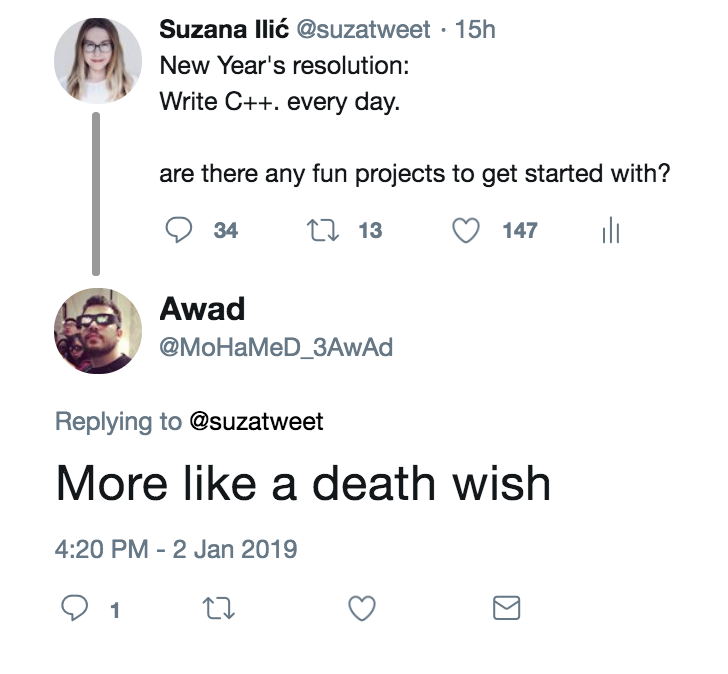
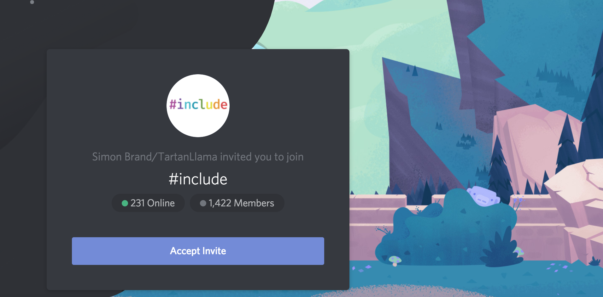

# C++ projects for beginners

### Based on the [Twitter thread](https://twitter.com/suzatweet/status/1080265246701277186)
 

## Join the community to discuss and learn about C++ 
**Twitter** [@include_cpp](https://twitter.com/include_cpp) and **Discord** [#include <C++>](https://discordapp.com/invite/ZPErMGW)

## Curated list of C++ (or C) frameworks, libraries, resources, and shiny things.
[https://github.com/fffaraz/awesome-cpp/](https://github.com/fffaraz/awesome-cpp/)

## Github

### 42 Subjects: C++
This is what we use at 42 to learn the basics of C++ . The curriculum is created for two weeks, a day pdf should take one day and the rushes are weekend projects.
[https://github.com/Binary-Hackers/42_Subjects/tree/master/01_Piscines/CPP](https://github.com/Binary-Hackers/42_Subjects/tree/master/01_Piscines/CPP)

### C++ BitMagic library of compressed bitset - matrix operations and containers.
[https://github.com/tlk00/BitMagic/](https://github.com/tlk00/BitMagic/)

### Check the latest C++ ML library released by FAIR
CPU support is not available yet
[https://github.com/facebookresearch/flashlight](https://github.com/facebookresearch/flashlight)

### Deep Learning
Libtorch project, writing deep learning research projects in C++. Compile it using CMake and clang.
[https://github.com/dendisuhubdy/libtorch_examples](https://github.com/dendisuhubdy/libtorch_examples)

### Fast Neural Machine Translation in C++
Marian is an efficient Neural Machine Translation framework written in pure C++ with minimal dependencies. 
[https://marian-nmt.github.io/](https://marian-nmt.github.io/)

## Projects

### Open Frameworks
Try to build something fun using [@openframeworks](https://twitter.com/openframeworks).

- [openFrameworks](https://openframeworks.cc/) is an open source C++ toolkit for creative coding.
- Read more: [ofBook](https://openframeworks.cc/ofBook/chapters/foreword.html)

### Play with darknet + zeromq
[https://pjreddie.com/darknet/yolo/](https://pjreddie.com/darknet/yolo/) 

### Help develop some OSS projects
e.g. GUI environments:

- **fluxbox** [http://fluxbox.org/](http://fluxbox.org/)
- **LXQt** [http://fluxbox.org/](https://lxqt.org/) 

or data processing software:
**port of R data.table package to Python**

### Conway's Game of Life
You could make a [Conway's Game of Life](https://en.wikipedia.org/wiki/Conway%27s_Game_of_Life) simulator in C++. Its something I built as a project in my high School CS class.

## YouTube

### Embedded programming with the Arduino Microcontroller.

## Blogs

### Neural networks, audio synthesis, graphics, math, cryptography and more :)
[https://blog.demofox.org/](https://blog.demofox.org/)

## Code and Tutorials

**Write a compiler using llvm following the tutorial?** 
[https://llvm.org/docs/tutorial/](https://llvm.org/docs/tutorial/ )

**LeetCode** 
[https://leetcode.com/problemset/all/](https://leetcode.com/problemset/all/)

## Some more ideas and comments

- **A compiler for a simple C subset**
- **A mini text editor**
- Implement some **simplified standard library classes, like std::vector**
- An **ELF file manipulation tool**

[**"Ray tracing in a Weekend"**](http://www.realtimerendering.com/raytracing/) is a nice book that shows how to implement a ray tracer, could be an interesting C++ project.

If you want fun, make a game? I recommend an **othello game** to play in terminal first (human vs human), then add a graphical interface, then make the opponent an **AI (minmax algorithm is good enough)**. You'll learn Cpp  in depth and have a fun game of your own 😁

My hobby is **(re)implementing the C++ Standard Library from scratch**, using the latest version of the language. That means starting over every 3 years, and the more I learn about testing (and templates), the less progress I make! But I always learn something :)

Just look at @nim_lang and **@NimTorch if you need native code, it will generate C++ for you!** Looks like python almost and runs on top of the same core libraries of @PyTorch!

Implement the **ML stuff** that’s hard.
E.g your own random forest, that’s multithreaded. A CRF with chain>1
Also, I learnt a lot doing automatons like Levenstein automata

One strategy: **re-implement your old code (or papers) in C++** and then move to something new. Look up to learn syntax, features, thinking, support/ecosystem, etc.

Make a **tensor library**, I’m thinking of making my own do library in c++ to learn more about the lower level features

How about a **refactoring library/tool**? When I used to write C++, I always wished there were good refactoring tools as there were for Java, for example.

Try to make a **web api to manage a help desk**... Just using c++ that a good way to start the new year...

You can write a framework with 2d graphics without APIs and without using the standard library other than for malloc, memcpy and sprintf. Thus you **develop your own base library** for general programming that will be useful for everything you work on and you can always improve it

You have to start with your own **C++ build system for C++**, of course :D

Do **hardware stuff. Edge ML, Deep learning with hardware (ARM CPUs, FPGA)** is low hanging fruit. Sometimes not C++, also need to dabble with verilog and/or asm.

This is plain C but may be of interest? **“Build Your Own Lisp Learn C and build your own programming language in 1000 lines of code!”** [http://www.buildyourownlisp.com](http://www.buildyourownlisp.com)

**Unreal C++** can be a next step if graphics is an interest--imo a frustratingly illogical design vs. oF, but makes short work of huge hassles like importing media assets and applying complex post effects.
